# Awesome Command-Line Shell Scripting 🚀

  
  
  
  
  

---

## 📌 Overview & SEO Summary 🔍

Welcome to the ultimate **Awesome Command-Line Shell Scripting** hub! This repository is a meticulously curated index of **shell interpreters**, **SaaS developer platforms**, **CLI terminal productivity tools**, and **open-source shell scripting projects**. 

Whether you are seeking powerful POSIX-compliant shells (like Bash and Zsh), modern structured data shells (such as Nushell), or commercial enterprise ecosystem support, this guide delivers comprehensive technical comparisons, market context, pricing structures, and star metrics.

**Last updated: October 2026** 📅

---

## 📖 Table of Contents 📑

- [☁️ Commercial Products & Enterprise SaaS](#-commercial-products--enterprise-saas)
- [🔓 Open-Source GitHub Projects](#-open-source-github-projects)
- [🛠️ Additional Open-Source CLI & Productivity Tools](#️-additional-open-source-cli--productivity-tools)
- [🤝 How to Contribute](#-how-to-contribute)
- [☕ Support & Sponsorship](#-support--sponsorship)
- [⚠️ Disclaimer](#-disclaimer)
- [📊 Star History](#-star-history)

---

## ☁️ Commercial Products & Enterprise SaaS 💼

> **📊 Market Size & Industry Structure**: The command-line shell market is estimated at **$1.5B – $2.5B annually** globally, primarily driven by enterprise Linux OS support subscriptions (e.g., Red Hat RHEL, SUSE Linux), managed cloud CLI environments, and AI-native terminal productivity platforms. The market is **highly concentrated (winner-takes-most)**, dominated by enterprise OS titans (Microsoft, IBM/Red Hat) with emerging AI terminal startups (Warp) creating new commercial niches.

| Product | Description | Pricing | Free Tier Limits | Company Size / Valuation |
|---|---|---|---|---|
| **[Microsoft PowerShell](https://microsoft.com/powershell)** 💻 | Cross-platform task automation and configuration management framework built on .NET 10. PowerShell 7.6 LTS offers object-oriented pipelines, structured output, and cross-platform cmdlet support. | **$0/mo** (Core 7.x open-source under MIT; Windows PowerShell 5.1 bundled free with Windows OS) | **Unlimited** (Full functionality, perpetual usage, zero feature locks or execution caps) | **~$2.95T Market Cap / ~$281B ARR** (Microsoft FY2025) |
| **[Red Hat Enterprise Linux (RHEL) Shell Support](https://www.redhat.com/en/technologies/linux-platforms/enterprise-linux)** 🐧 | Commercial enterprise-grade support, security auditing, and compliance certifications for POSIX Bash and system scripting tooling. | **$349/year** per entry server node (Physical/Virtual Server standard support tier) | **16 nodes free** (Red Hat Developer Subscription for Individuals, full production access for up to 16 systems) | **~$34B Acquisition Valuation / ~$5.5B ARR** (Red Hat under IBM) |
| **[Warp Terminal](https://www.warp.dev)** ⚡ | AI-native, modern terminal environment with embedded collaborative workflows, command completion, and AI agent assistance. | **$20/mo** (Build Plan) / **$50/user/mo** (Business Team Plan) | **75 AI credits/month free forever** (Core terminal features 100% free with unlimited local usage) | **~$500M Valuation / $73M VC Funding** |

---

## 🔓 Open-Source GitHub Projects 🌟

Below is a curated list of leading open-source shell interpreters and scripting engines, **sorted by GitHub star count (descending)**. Each badge links directly to the repository's stargazers page.

| Repo | Description | Stars Badge |
|---|---|---|
| **[PowerShell](https://github.com/PowerShell/PowerShell)** 💙 | Microsoft's official cross-platform command-line shell and scripting language built on .NET. Features object-based pipelines and rich cmdlet libraries. |  |
| **[Nushell](https://github.com/nushell/nushell)** ⚡ | A modern shell written in Rust that treats all data as structured tables rather than text streams. Features typed pipelines and actionable error diagnostics. |  |
| **[Fish Shell](https://github.com/fish-shell/fish-shell)** 🐟 | Smart, friendly interactive shell featuring web-based configuration, instant syntax highlighting, and autosuggestions out of the box. |  |
| **[Xonsh](https://github.com/xonsh/xonsh)** 🐍 | Python-powered, cross-platform shell. Merges Python 3.6+ syntax seamlessly with shell commands for advanced scripting and interactive CLI work. |  |
| **[Elvish](https://github.com/elves/elvish)** 🧝 | Expressive, functional shell language written in Go featuring structured data handling, namespaces, anonymous functions, and interactive UI widgets. |  |
| **[Zsh](https://github.com/zsh-users/zsh)** 🐚 | Advanced interactive Unix shell with extensive tab-completion, programmable theme/plugin engines, and full backward compatibility with sh/ksh. |  |
| **[Oil Shell (Oils)](https://github.com/oils-for-unix/oils)** 🛢️ | Next-generation Unix shell offering full Bash compatibility via OSH and a clean, modern, typed language design via YSH. |  |
| **[Murex](https://github.com/lmorg/murex)** 🐚 | DevOps-focused shell engineered for safety, productivity, and handling complex data formats (JSON, YAML, CSV) directly in CLI pipelines. |  |
| **[NYAGOS](https://github.com/nyaosorg/nyagos)** 🐈 | Nihongo Yet Another GOing Shell. Windows-tailored hybrid command-line shell with Lua extension scripting and UTF-8 support. |  |
| **[tcsh](https://github.com/tcsh-org/tcsh)** ⚙️ | Enhanced C shell (`csh`) with programmable command completion, command-line editing, and job control capabilities. |  |
| **[KornShell (ksh93)](https://github.com/ksh93/ksh)** 📜 | POSIX-compliant KornShell adding associative arrays, floating-point arithmetic, and advanced loop control structures. |  |
| **[Dash](https://git.kernel.org/pub/scm/utils/dash/dash.git)** ⚡ | Debian Almquist Shell. Minimalist, ultra-fast POSIX shell designed for POSIX-compliant script execution and fast system boot routines. |  |

---

## 🛠️ Additional Open-Source CLI & Productivity Tools 🚀

Sorted by GitHub star count (descending):

| Repo | Description | Stars Badge |
|---|---|---|
| **[The Art of Command Line](https://github.com/jlevy/the-art-of-command-line)** 📚 | Comprehensive guide and cheat-sheet covering essential to advanced command-line mastery for Linux and macOS developers. |  |
| **[Oh My Zsh](https://github.com/ohmyzsh/ohmyzsh)** 🌈 | Community-driven framework for managing Zsh configurations with 300+ plugins, 140+ themes, and auto-updates. |  |
| **[TheFuck](https://github.com/nvbn/thefuck)** 🤬 | Magnificent app that corrects errors in previous console commands via intelligent auto-fix algorithms. |  |
| **[nvm](https://github.com/nvm-sh/nvm)** 📦 | Node Version Manager. Simple POSIX-compliant bash script to manage multiple active Node.js versions. |  |
| **[Starship](https://github.com/starship/starship)** 🚀 | Minimal, ultra-fast, and customizable cross-shell prompt for any shell, written in Rust. |  |
| **[bats-core](https://github.com/bats-core/bats-core)** 🧪 | Bash Automated Testing System. TAP-compliant testing framework for Bash scripts and CLI executables. |  |
| **[Rad](https://github.com/amterp/rad)** ⚡ | Modern command-line tool for concise shell scripting with declarative arguments and JSON parsing support. |  |

---

## 🤝 How to Contribute 🛠️

1. **Fork** this repository.
2. Add your candidate shell project or SaaS tool to `README.md` following the exact table structure.
3. Include valid GitHub link, star badge, and factual feature overview.
4. Open a **Pull Request**!

---

## ☕ Support & Sponsorship 💖

Thank you for visiting and using this resource! If you find this awesome collection helpful for your terminal workflows, command-line automation, or dev setup:

- ⭐ **Star** this repository to stay updated.
- 🔀 **Fork** it to keep your own curated version.
- 📢 **Share** it with fellow system administrators, developers, and DevOps engineers!

If you'd like to support ongoing maintenance and new tools discovery, consider buying a coffee or becoming a sponsor:

---

## ⚠️ Disclaimer ⚖️

- This directory is a **community-curated list** created for informational and educational purposes.
- Shell scripts and terminal binaries execute commands with system-level privileges; always audit third-party scripts before executing them in production.
- All product names, logos, and brands are property of their respective owners.

---

## 📊 Star History 📈

---

  Crafted with ❤️ for developers, system administrators, and terminal power users worldwide.

